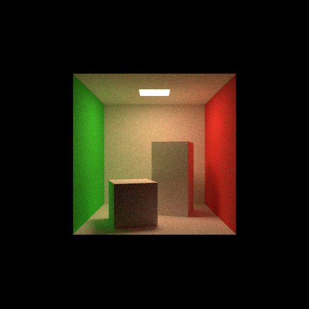

# Path Tracing in 5minutes

Single file path tracer written in C++.

This is reference implementation of [Path Tracing in 5minutes](https://speakerdeck.com/yumcyawiz/path-tracing-in-5-minutes)



## Requirements

* C++17 or Higher
* CMake 3.12 or Higher

## Build

```
mkdir build
cd build
cmake ..
make
```

## Run

```
./build/main
```